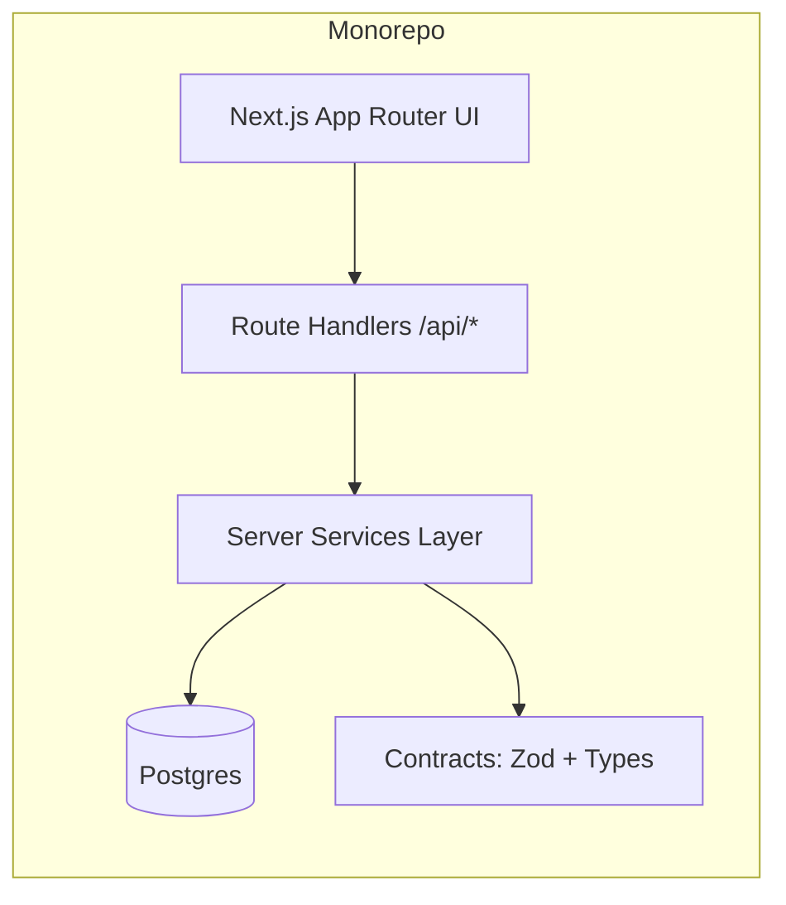
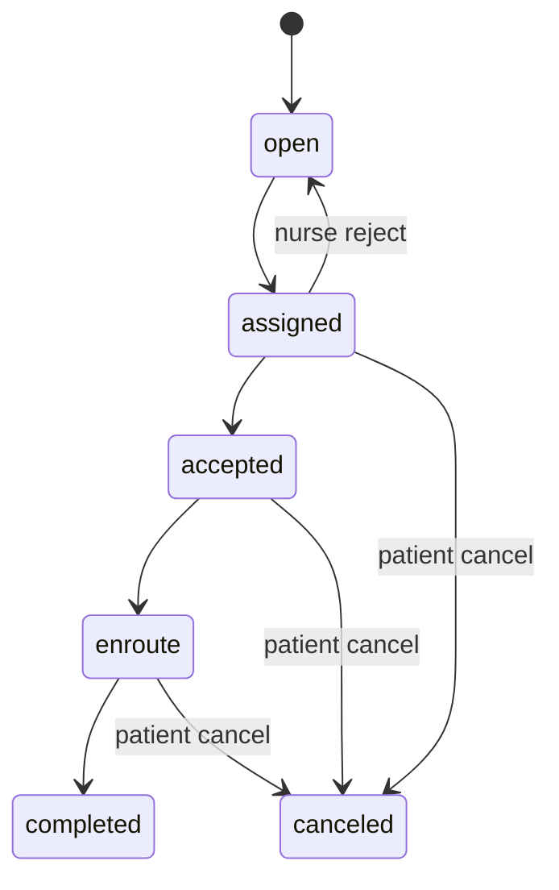

# NurseConnect V3 — Handover

**Repo:** `https://github.com/arbenl/nurseconnect-v3`  
**Last updated:** 2026-02-19  
**Stack:** Next.js 14 (App Router) + TypeScript + Tailwind/shadcn/ui + PostgreSQL + Drizzle + Better-Auth  
**Monorepo:** pnpm + Turborepo  
**Testing:** Vitest (jsdom + node lanes), DB integration, API-first E2E (blocking), Playwright UI E2E (quarantined/manual)

---

## 1) Executive Summary

NurseConnect V3 is a monorepo-based healthcare platform connecting patients with nearby nurses for in-home visits. V3 is built on a **Postgres + Drizzle + Better-Auth** foundation (Firebase removed), with an **“Interdomestik-grade”** emphasis on deterministic behavior, strict contracts, and reliable CI gates.

Completed milestones include:
- Auth foundation & cleanup (Firebase/NextAuth removal)
- Patient onboarding + server-side guards (profile completion)
- Nurse onboarding + guards (nurse profile completion)
- Nurse availability + “Become a nurse” self-onboarding
- Patient “request a visit” MVP with **race-safe nearest-nurse allocation**
- Request lifecycle actions using **strict state machine + row locking**
- Request events/audit timeline (PR-4.0): append-only `service_request_events`, event writes on request lifecycle, authorized timeline endpoint
- Robust CI/test strategy with **API-first E2E as the blocking lane** (UI E2E quarantined)

---

## 2) Repository Layout & Architecture

### Monorepo layout (high-level)
- `apps/web` — Next.js app (UI + API routes + server services)
- `packages/database` — Drizzle schema, migrations, DB client
- `packages/contracts` — Zod schemas + shared types (API contracts)
- `packages/ui` — shared UI components (shadcn wrapper / app UI)

### Server pattern (important conventions)
- API routes: `apps/web/src/app/api/...`
- Domain services: `apps/web/src/server/...`
- **Contract-first approach**:
  - Zod schemas and shared types live in `packages/contracts`
  - API routes, server services, and client hooks import from contracts
  - Client state is based on **authoritative typed endpoints** (esp. `/api/me`)

---

## 3) Local Development Workflow (Known-Good)

### Prereqs
- Node.js `>= 20`
- pnpm `>= 9`
- Docker

### Standard workflow
```bash
pnpm install
docker compose up -d
pnpm db:migrate
pnpm dev

# sanity check
curl -s http://localhost:3000/api/health/db
```

### Optional (explicit web dev)

```bash
pnpm --filter web dev
```

---

## 4) Authentication & RBAC

### Current state

- **Better-Auth is the only auth provider**
- NextAuth fully removed (dependencies + route handlers + configs)

### Core endpoints

- `GET /api/me`

  - Returns session-backed user state using a strict response type (`MeResponse`)
  - **Authoritative source** for client-side guards and user state
- `GET /api/admin/ping`

  - Used to validate RBAC:

    - unauth → `401`
    - wrong role → `403`
    - admin → `200`

### Admin bootstrap policy

- “First admin bootstrap” / allowlist mechanism exists to safely create initial administrative control.
- Promotions remain guarded by server-side checks.

---

## 5) Onboarding & Guards

### Patient onboarding (PR-3.3)

- Added profile fields on users and server-derived `profileComplete`
- `/onboarding` page implemented
- Layout-level guard: incomplete users are redirected until completion
- `useUserProfile` hook aligned with strict `MeResponse` contract and includes mutation helpers

### Nurse onboarding (PR-3.4)

- `nurses` table extended with nurse fields (license number, specialization, availability flags)
- Dashboard guard updated: nurses can’t proceed until nurse fields complete
- Migration reproducibility hardened (clean DB rebuild must work)

---

## 6) Nurse Availability & “Become a Nurse”

### Availability

- Nurse can toggle `isAvailable` via UI and backend endpoint(s)
- Availability affects request allocation and request lifecycle actions:

  - accept/release nurse

### Become a nurse

- `POST /api/me/become-nurse`
- Dashboard includes a card allowing self-promotion to nurse by submitting license details
- Flow continues into nurse onboarding + guard checks

---

## 7) Patient “Request a Visit” MVP (Allocation)

### Goal

Patient creates a request → system assigns the nearest available nurse.

### Database concepts

- `service_requests`

  - links to patient user + assigned nurse user
  - status field
  - address + lat/lng + timestamps
- `nurse_locations`

  - nurse user id
  - lat/lng + `lastUpdated`

### Allocation strategy (key properties)

- **Race-safe allocation** inside a DB transaction
- Uses `FOR UPDATE ... SKIP LOCKED` to avoid double assignment under concurrency
- Lat/lng stored as **NUMERIC** to avoid float rounding issues
- Deterministic tie-break:

  - sort by distance, then `nurseUserId`

### API endpoints

- `POST /api/requests`

  - Creates request and attempts immediate assignment
- `GET /api/requests/mine`

  - Returns requests relevant to current user (patient or nurse)

---

## 8) Request Lifecycle (State Machine + Actions) — PR-3.8

### Goal

Implement request lifecycle transitions with strict rules and safe concurrency.

### Lifecycle states (implemented)

- `assigned -> accepted -> enroute -> completed`
- nurse reject reopens to `open`
- patient cancel sets to `canceled`
- repeated/conflicting action returns `409`

### Safety rules (implemented)

- Accept requires:

  - assigned nurse matches actor
  - nurse profile complete
  - `isAvailable = true`
- Accept flips nurse `isAvailable = false`
- Reject/complete/cancel releases nurse (`isAvailable = true`)
- All actions use server-side authorization checks + row lock (`FOR UPDATE`)

### API endpoints

- `POST /api/requests/[id]/accept`
- `POST /api/requests/[id]/reject`
- `POST /api/requests/[id]/enroute`
- `POST /api/requests/[id]/complete`
- `POST /api/requests/[id]/cancel`

### Key implementation locations

- `apps/web/src/server/requests/request-lifecycle.ts`
- `apps/web/src/server/requests/request-actions.ts`
- `apps/web/src/server/requests/request-action-http.ts`

### Migration

- Drizzle migration for status enum and lifecycle timestamps:

  - `packages/database/drizzle/0004_misty_whizzer.sql`

### Tests for PR-3.8

- Unit tests for lifecycle rules
- DB integration tests for action flows
- API-first E2E expanded to verify lifecycle

---

## 9) Testing & CI Gates (Interdomestik-style)

### Test lanes (typical)

1. Type-check

```bash
pnpm -w type-check
```

2. Lint

```bash
pnpm lint
```

3. Unit tests (jsdom lane)

```bash
pnpm test:ci
```

4. DB integration tests (node lane)

```bash
pnpm --filter web test:api
```

- Runs in node env with Postgres
- Truncates/reseeds deterministically

5. API-first E2E (blocking)

```bash
pnpm gate:e2e-api
# (alias may exist via gate:e2e)
```

- Runs with `E2E_TEST_MODE=1`
- Requires correct `APP_URL` / `BETTER_AUTH_URL`

### CI rules

- Merge only when all blocking lanes are green.
- UI E2E is non-blocking/manual until stabilized.

---

## 10) CI/CD Notes

### Blocking jobs usually include

- `quality`: type-check + lint
- `unit`: jsdom tests
- `db-integration`: Postgres service + migrate + node DB tests
- `e2e-api`: Postgres service + migrate + API E2E suite

### Important env vars (especially for CI E2E)

- `DATABASE_URL`
- `E2E_TEST_MODE=1`
- `APP_URL` and `BETTER_AUTH_URL` (**must match test baseURL + port**)

---

## 11) Known Failure Modes & Fix Patterns

### A) Better-Auth “Invalid origin”

**Symptom:** `403 INVALID_ORIGIN` on auth endpoints in CI.  
**Fix:** set `APP_URL` / `BETTER_AUTH_URL` explicitly to the same origin used by tests (ex: `http://localhost:3010`).

### B) Better-Auth “Unsupported media type” on sign-out

**Symptom:** `415 UNSUPPORTED_MEDIA_TYPE` complaining about Content-Type.  
**Fix:** send JSON body + header `Content-Type: application/json`.

### C) Missing tables in CI DB tests

**Symptom:** `relation "nurse_locations" does not exist`.  
**Fixes used:**

- ensure migration exists and is committed
- ensure `drizzle/meta/_journal.json` is tracked (not gitignored)
- ensure CI runs `pnpm db:migrate` before DB tests & E2E

### D) UI Playwright flakiness

**Symptom:** timeouts for conditional dashboard cards/redirects/hydration.  
**Fix:** API-first E2E is blocking; UI E2E quarantined (manual `workflow_dispatch`).

---

## 12) Merge Discipline

**Rule:** Commit → Push → Merge only when CI is green for blocking lanes.

If you have many uncommitted files, prefer small commits by concern:

- `feat:` behavior changes
- `test:` tests only
- `ci:` workflow-only changes
- `chore:` formatting/docs/cleanup

Push early to let CI validate incrementally.

---

## 13) Recommended Next Milestone (PR-4.1+)

Pick one based on product priority.

### Option 1 — Admin console MVP (recommended)

**Why:** highest operational leverage now that lifecycle and timeline data are deterministic and authorized.

**Scope**

- Admin-only read-only views:

  - users
  - nurses
  - requests
- Request detail view uses existing authorized event timeline:
  - `GET /api/requests/[id]/events`
- RBAC tests on API-first E2E

### Option 2 — Request timeline UI for patients/nurses

**Why:** product-visible auditability with low backend risk.

**Scope**

- Add timeline card(s) in request detail using existing timeline endpoint
- Show actor + transition + timestamp sequence

### Option 3 — Notifications baseline

- Polling-based “new assignment” notification
- Later move to SSE/WebSocket

### Option 4 — Stabilize UI E2E (optional)

- Only if ROI is worth it now
- Otherwise keep quarantined/manual

### Option 5 — Nurse location quality (follow-up)

- Improve freshness/accuracy assumptions in allocation source-of-truth flow
- Keep throttle/race behavior deterministic

---

## 14) Diagrams (Markdown-friendly)

### High-level architecture (conceptual)



### Request lifecycle



---

# Appendix A — Quick Verification Checklist (Local)

- [ ] `docker compose up -d`
- [ ] `pnpm db:migrate`
- [ ] `curl -s http://localhost:3000/api/health/db`
- [ ] `pnpm -w type-check`
- [ ] `pnpm lint`
- [ ] `pnpm test:ci`
- [ ] `pnpm --filter web test:api`
- [ ] `pnpm gate:e2e-api` (ensure env vars are correct)

---

# Appendix B — Leadership One-Pager + Next 3 PRs Plan (embedded)

## One-page leadership summary

**What we built**

- A deterministic, contract-driven healthcare platform MVP that connects patients to nearby nurses for in-home visits.
- Replaced Firebase/NextAuth with a single Better-Auth foundation and strengthened server-side guards and RBAC checks.
- Implemented race-safe nurse allocation and a strict request lifecycle state machine with row locking for concurrency safety.
- Built CI gating around stable, deterministic tests: type-check, lint, unit, DB integration, and API-first E2E.

**Why this matters**

- Allocation is safe under concurrency (no double-assignments).
- Lifecycle transitions are enforced server-side with correct authorization.
- CI gates catch regressions early with a stable test strategy (UI E2E kept manual until stabilized).

**Current operational posture**

- Engineering velocity is protected by strict contracts and deterministic tests.
- Known auth/CI gotchas are documented and fixed (origin + content-type).

## Next 3 PRs plan

### PR-3.9 — Nurse location update API + tests (completed)

**Deliverables**

- `PATCH/POST /api/me/location` endpoint (nurse-only)
- writes to `nurse_locations` with numeric lat/lng + `lastUpdated`
- deterministic throttling rule
- DB integration tests + API-first E2E coverage
- **Status:** completed (PR #3)

**Success metric**

- Nearest-nurse allocation demonstrably improves (and is test-verified).

### PR-4.0 — Request events/audit timeline (append-only)

**Deliverables**

- `service_request_events` table + event writer utility in service layer
- each lifecycle action appends an event
- `GET /api/requests/[id]/events` endpoint with role-gated access
- DB + API-E2E test coverage
- **Status:** completed (PR #4)

**Success metric**

- Supportability: requests are explainable (“who did what when”) without reading logs.

### PR-4.1 — Admin console MVP (read-only first, next)

**Deliverables**

- admin-only screens: users, nurses, requests
- RBAC tests around admin endpoints and UI guards
- optional controlled role change flow (behind allowlist/guard)

**Success metric**

- Fast operational visibility + safer support workflows without direct DB access.

### PR-4.2 — Request timeline UX (optional)

**Deliverables**

- add timeline card on patient/nurse request detail views
- reuse `/api/requests/[id]/events` for read-only event rendering
- deterministic ordering by DB id/created timestamp

**Success metric**

- Better user-facing auditability without changing backend behavior.
