# NurseConnect v3 — Enterprise-Readiness Architecture Report

**Author:** Principal/Staff architecture review
**Date:** 2026-06-02
**Scope:** `nurseconnect-v3` (read-only analysis). `interdomestik` (`interdomestik-crystal-home`) was mounted in a **second pass** and analyzed directly — see §5, now verified file-by-file.
**Method:** Static reading of `AGENTS.md`, `package.json` files, `turbo.json`, `apps/web` App Router + server modules, `packages/database` Drizzle schema, `packages/contracts`, all `packages/domain-*`, auth/session code, CI workflows, and architecture docs. No files were modified.

A note on confidence: claims tied to a file path are **facts** observed in the code. Anything about intent, traffic, or operations is labeled **assumption** because it cannot be verified from source alone.

---

## 1. Executive Summary

NurseConnect v3 is a **well-structured modular monolith**, not a typical early-stage tangle. It already does several things most pre-enterprise codebases get wrong: a pnpm/Turbo workspace with genuine domain package boundaries (`domain-identity`, `domain-request`, `domain-dispatch`, `domain-nurse`, `domain-admin-ops`, `domain-payments`, `domain-visit`, `domain-referral`), a contracts-first design (`packages/contracts` Zod schemas shared across API and domains), an append-only **request event log** (`service_request_events`), an **admin audit log** (`admin_audit_logs`), and a concurrency-correct dispatch using `FOR UPDATE … SKIP LOCKED` (`packages/domain-dispatch/src/candidate-selection.ts`). CI is unusually mature for the product's age: Gitleaks secret scanning, type-check, lint, build, Vitest, Playwright API/UI E2E, and a SonarQube quality gate (`.github/workflows/ci.yml`, `sonar.yml`).

That is the good news. The **single largest enterprise blocker is the complete absence of multi-tenancy.** There is no `organization`/`account`/`tenant` entity and no `tenant_id` on any domain table (verified: tenant/org columns appear only in `packages/database/src/schema/auth.ts`, which is Better-Auth's own tables, and the only "organization" concept is a free-text `organization_name` string on `referral_partners`). Every enterprise customer — a hospital network, a staffing agency, a home-health franchise — needs isolation, org-scoped roles, and org-scoped data. Retrofitting tenancy after data exists is the most expensive migration in this report, so it must be decided early.

The **second structural risk is the dual-identity auth seam.** Authentication lives in Better-Auth tables keyed by `text` id (`auth_users`), while the domain keys users by `uuid` (`users.id`) and links them via a nullable `users.auth_id` (`packages/database/src/schema/users.ts`, `auth.ts`). Two sources of truth for "who is this person," joined by a nullable text column, is a correctness and security liability that compounds as you add SSO, SCIM, and org membership.

The **third is domain-specific and serious: this is healthcare, and the codebase shows almost no compliance posture.** Patient addresses, coordinates, and `care_type` (effectively PHI) are stored as plaintext columns with no field-level access control, no data-retention policy, no PHI access logging (the audit log covers *admin* actions, not *reads* of patient data), and no encryption-at-rest strategy beyond whatever Postgres/host provides. For US healthcare staffing, HIPAA is not optional, and the gap is wide.

Everything else — RBAC that needs to become org-aware ABAC, the lack of a background-job/outbox mechanism (dispatch runs inline inside the create-request transaction), Vercel-only observability, and the absence of a CRM/relationship layer — is real but tractable and sequenced in the roadmap (§9).

**Bottom line:** the foundations are genuinely good. NurseConnect is closer to enterprise-ready in *engineering hygiene* than most products at this stage, and further away in *tenancy, identity, and compliance* than its polish suggests. Do not let the clean monorepo lull you into skipping the tenancy and PHI decisions — those are the ones that get more expensive every week.

---

## 1.5 Architecture Comparison Blueprint (Side-by-Side)

Below is a premium visual mapping comparing the Current Architecture bottlenecks with the Aspirational Target Architecture features (isolation boundaries, transactional outboxes, and async job queues):


---

## 2. Current Architecture Map

### 2.1 Topology (fact)

```
nurseconnect-v3/ (pnpm + Turborepo, Node ≥20, Vercel-native)
├── apps/web/                     Next.js 14.2 App Router (the only app)
│   └── src/
│       ├── app/                  Routes + API route handlers
│       │   ├── (app)/ (auth)/ (dev)/   route groups
│       │   ├── admin/            admin portal pages
│       │   └── api/              ~40 route.ts handlers (BFF layer)
│       ├── server/               server-only modules (auth, requests, admin, payments…)
│       ├── lib/                  auth client, routing, rate limit, telemetry
│       ├── components/           shadcn/Radix UI, dashboard, admin, partner
│       └── hooks/                react-query hooks (only 2)
├── packages/
│   ├── contracts/                Zod schemas + shared types (the API contract)
│   ├── database/                 Drizzle schema (14 tables) + migrations + pool
│   ├── domain-identity/          session/role/portal-access policies
│   ├── domain-request/           request lifecycle state machine + events
│   ├── domain-dispatch/          candidate selection, service-area, assignment
│   ├── domain-nurse/             nurse credentialing
│   ├── domain-admin-ops/         admin operations
│   ├── domain-payments/          payment authorizations/payouts
│   ├── domain-visit/             visit records
│   ├── domain-referral/          referral partners
│   ├── platform-telemetry/       structured logging + admin-audit helper
│   └── ui/                       shared UI primitives
└── .github/workflows/            ci.yml + sonar.yml
```

### 2.1.1 Visual Current Architecture (Flow & Bottlenecks)

The following diagram maps the current state of NurseConnect v3. It highlights the major architectural bottlenecks: a single-tenant database layer without Row-Level Security, a fragile dual-identity auth seam joining Better-Auth string IDs and domain UUIDs via a nullable `auth_id`, and a completely synchronous request allocation flow running inline inside the database transaction:

```mermaid
graph TD
    classDef current fill:#fee2e2,stroke:#ef4444,stroke-width:2px,color:#991b1b;
    classDef client fill:#e0f2fe,stroke:#0284c7,stroke-width:1px,color:#0369a1;
    classDef database fill:#f3f4f6,stroke:#4b5563,stroke-width:1px,color:#1f2937;
    classDef shared fill:#fef9c3,stroke:#ca8a04,stroke-width:1px,color:#854d0e;

    subgraph Presentation ["Presentation Layer (Vercel-native Next.js)"]
        A["Client Browser (React 19 / Radix UI / Local Components)"]:::client
    end

    subgraph WebAppShell ["Next.js App Router Shell (apps/web)"]
        B["Next.js Route Handlers (BFF / app/api/*)"]:::current
        C["Server Actions / Server-Only Modules (src/server/*)"]:::current
    end

    subgraph PnpmWorkspace ["pnpm Workspace Modules (packages/*)"]
        subgraph DomainModules ["Domain Modules (Tight, but in-process imports)"]
            D["domain-identity"]:::current
            E["domain-request"]:::current
            F["domain-dispatch (FOR UPDATE... SKIP LOCKED)"]:::current
            G["domain-nurse"]:::current
            H["domain-visit"]:::current
            I["domain-referral"]:::current
            J["domain-payments"]:::current
            K["domain-admin-ops"]:::current
        end
        L["contracts (Zod Schemas)"]:::shared
        M["platform-telemetry (Structured logs)"]:::shared
        N["ui (Thin helpers)"]:::shared
    end

    subgraph DataStore ["Data Layer (Single-Tenant Postgres)"]
        DB[("PostgreSQL Database
        (14 Drizzle Tables, No RLS)")]:::database
        subgraph AuthTables ["Dual Auth Stores (Identity Seam)"]
            BA["Better-Auth Tables (auth_users - text ID)"]:::current
            DU["Domain User Table (users - UUID)"]:::current
        end
    end

    %% Flows
    A -->|HTTPS / API Requests| B
    B -->|Zod Parse & Orchestration| C
    C -->|Flat Role Checks / in-process call| D
    C -->|Sync DB Transaction (Row Locks)| DomainModules
    DomainModules -->|Direct Queries| DB
    D -->|Nullable auth_id Join| AuthTables
    B -.->|Structured Log Events| M
```

### 2.2 Frontend (fact)

Next.js 14 App Router with React 19, TanStack Query (`@tanstack/react-query`), React Hook Form + Zod resolvers, Radix primitives + `class-variance-authority` (shadcn-style), Tailwind, `next-themes`. State is deliberately **server-driven**: only two client hooks exist (`use-nurse-assignment-feed.ts`, `use-user-profile.ts`), and providers are centralized (`components/providers/QueryProvider.tsx`). Route groups separate `(app)`, `(auth)`, and `admin`. **Assessment:** clean and conventional; this is the least risky layer.

### 2.3 Backend / API (fact)

There is no separate backend service. API is **Next.js route handlers acting as a backend-for-frontend** (`apps/web/src/app/api/**/route.ts`). The consistent pattern (see `app/api/requests/route.ts`, `app/api/requests/[id]/accept/route.ts`):

1. `createApiLogContext` + `logApiStart` (telemetry),
2. `requireRole(...)` / `requireAnyRole(...)` (authz),
3. parse body with a **contracts** Zod schema,
4. call a `server/*` orchestration function which calls **domain-\*** packages,
5. structured success/failure logging with a propagated `requestId`.

Domain logic is pure and lives in packages; route handlers and `server/*` are the impure shell that touches `db` and `headers()`. This is a solid hexagonal-ish split.

### 2.4 Data / domain model (fact)

14 Drizzle tables (`packages/database/src/schema/index.ts`). Core graph:

- `users` (uuid pk, `role` enum `admin|nurse|patient|referral_partner`, `auth_id` link, profile fields)
- `nurses` (1:1 user; credential fields, `status` enum draft→verified→suspended/expired, license validity, verification audit)
- `patients` (1:1 user), `referral_partners` (1:1 user, free-text `organization_name`)
- `service_requests` (patient + optional assigned nurse, `status` 10-state enum, address/lat/lng, `care_type`, service area, dense timestamp columns per state)
- `assignments` (request↔nurse), `visits` (per assignment; summary, rating)
- `service_request_events` (append-only event log, typed, with from/to status + `jsonb meta`) — **event sourcing for requests**
- `admin_audit_logs` (actor, action, target type/id, `jsonb details`) — **audit trail for admin actions**
- `nurse_locations`, `service_areas`, `payment_authorizations`, `nurse_payouts`
- `auth_users` / `auth_sessions` / `auth_accounts` / `auth_verifications` (Better-Auth, `text` ids)

**Observation:** the request domain is modeled richly (state enum + event log + audit). The rest of the model is thin: `patients` and `visits` carry almost no clinical structure, and there is **no relationship/CRM substrate** (no contacts, notes, tasks, activities-timeline, communication log) beyond the request-scoped event stream.

### 2.5 Authentication & authorization (fact)

- **AuthN:** Better-Auth, email+password, `autoSignIn: true`, `requireEmailVerification: false` (`apps/web/src/lib/auth.ts`). Sessions via `auth.api.getSession()` (`server/auth/get-session.ts`).
- **AuthZ:** role checks resolved through `domain-identity` policies (`requireRole`, `requireAnyRole`, `resolvePortalAccessPolicy`) wired by `server/auth/*`. Portal access (`app` vs `admin`) and profile-completion gating live in `server/auth/portal-access.ts`.
- **Identity seam:** `auth_users.id` is `text`; `users.id` is `uuid`; the bridge is nullable `users.auth_id` (`uniqueIndex`). Two identity stores, one nullable join.

### 2.6 Roles / permissions (fact)

A **single flat enum** `user_role` on `users`. No permission table, no role-to-permission mapping, no resource-scoped grants, no ABAC. Authorization decisions are role-equality checks. Adequate for a 4-persona single-tenant app; insufficient for org-scoped enterprise roles (e.g., "agency coordinator at Org A, read-only at Org B").

### 2.7 Tenancy / account model (fact)

**None.** Single-tenant by construction. No tenant/org/account table; no `tenant_id` on domain rows (verified by search). `referral_partners.organization_name` is a label, not an isolation boundary.

### 2.8 Integrations (fact / assumption)

Observed: Better-Auth (authN), Vercel (`@vercel/otel`, analytics, speed-insights — telemetry), Postgres via Drizzle, optional `OPS_ALERT_WEBHOOK_URL` for ops alerts (`server/alerts/ops-alert.ts`). Payments exist as **internal domain tables** (`payment_authorizations`, `nurse_payouts`) — *assumption:* no external PSP (Stripe etc.) is wired in the code I read. No email/SMS/notification provider, no calendar, no EHR/HL7/FHIR integration. `AGENTS.md` references Playwright/Context7/Notion MCP tooling for *development*, not runtime integrations.

### 2.9 Background jobs / workflows (fact)

There is **no job queue, scheduler, or outbox.** Dispatch is **synchronous inside the create-request DB transaction** (`server/requests/allocate-request.ts`: create request → append event → `selectDispatchCandidate` → `assignRequestToNurse`, all in one `db.transaction`). The request lifecycle is an explicit in-process state machine (`packages/domain-request/src/request-lifecycle.ts`) driven by API calls, not by background workers. No retries, no scheduled re-dispatch of stale `open` requests, no async fan-out (notifications, payouts) — *assumption based on absence.*

### 2.10 Shared UI / component system (fact)

`packages/ui` is thin (just `lib/utils.ts` + index); most components live in `apps/web/src/components` (Radix + CVA). A design system exists in spirit (shadcn pattern, `components.json`, Tailwind tokens) but is **app-local, not packaged** for reuse across future apps/portals.

### 2.11 Testing & verification (fact)

Strong and multi-layered: Vitest unit tests co-located in every domain package (with coverage output), `*.db.test.ts` integration tests against Postgres, Playwright API E2E (`tests/e2e-api`) and UI smoke (`tests/e2e-ui`). Gate scripts (`gate:fast`, `gate:smoke`, `gate:e2e`, `gate:release`) and a bespoke **multi-agent "verify-slice"** review workflow (`scripts/multi-agent/`, `AGENTS.md`). SonarQube coverage + quality gate in CI.

### 2.12 Deployment / configuration (fact)

Vercel-native (`vercel.json`, build `pnpm --filter web build`). Config via env vars validated by `@t3-oss/env-nextjs` (`apps/web/src/env.ts`) and `scripts/env-check.mjs`; `turbo.json` enumerates global env including feature flags (`FEATURE_BACKEND_*`). Postgres connection pooling is explicitly tuned (`PGPOOL_*`, `packages/database/src/pool-config.ts`). `docker-compose.yml` is for **local Postgres + SonarQube only**, not production.

---

## 3. Key Risks & Bottlenecks

Ranked by blast radius.

**R1 — No multi-tenancy (critical, structural).** Every domain table would need a tenant boundary. The longer real data accumulates single-tenant, the more painful the backfill. Blocks every B2B enterprise deal that requires data isolation.

**R2 — Dual-identity auth seam (high).** `auth_users` (text id) ↔ `users` (uuid) joined by nullable `auth_id`. Risks: orphaned domain users with no auth row (or vice-versa), ambiguous "current user," and a fragile base for SSO/SCIM/org-membership. A null or mismatched `auth_id` is a silent authz hole.

**R3 — Compliance/PHI posture near-zero (high, domain-specific).** Patient address/geo/`care_type` and visit `summary` are plaintext with no access logging on *reads*, no retention/erasure policy, no field-level encryption, no BAA-driven controls. In US healthcare this is a legal blocker, not a nice-to-have.

**R4 — Synchronous dispatch, no async backbone (high for scale/reliability).** Allocation runs inside the create-request transaction holding row locks (`SKIP LOCKED` mitigates contention but the work is still inline). No outbox means side effects (notifications, payouts, re-dispatch of unassigned `open` requests) have nowhere reliable to run. Under load or partial failure, requests can sit `open` with no retry.

**R5 — Coarse RBAC (medium-high).** Flat role enum cannot express org-scoped or resource-scoped permissions. Will not survive the first enterprise org-hierarchy requirement.

**R6 — Observability is Vercel-coupled (medium).** Logging is structured (`platform-telemetry`) and a `requestId` is propagated — good — but traces/metrics/alerting are tied to Vercel + a single webhook. No SLOs, no error budget, no audit-grade log retention story.

**R7 — Payments are internal-only (medium, assumption).** Authorizations/payouts modeled in DB without an observed PSP integration — money movement, reconciliation, and PCI scope are undefined.

**R8 — Design system not packaged (low-medium).** Components are app-local; a second portal (e.g., enterprise admin) would fork UI.

**R9 — Repo hygiene noise (low).** Committed artifacts that shouldn't be in VCS: `apps/web/firestore-debug.log`, `apps/web/test_output*.txt`, `server.pid`, `phase0_pack.zip`, `tsconfig.tsbuildinfo`. Cosmetic, but signals gaps in `.gitignore` discipline.

---

## 4. Enterprise-Readiness Scorecard

Scale: 🔴 absent/blocking · 🟡 partial · 🟢 solid. Score is current state, not potential.

| Dimension | Score | Evidence / Rationale |
|---|---|---|
| Scalability | 🟡 | Stateless Next on Vercel + tuned PG pool scale horizontally; but inline dispatch and no queue cap throughput and reliability. |
| Maintainability | 🟢 | Clear domain packages, contracts-first, co-located tests, consistent route pattern. |
| Modularity | 🟢 | Real package boundaries (`domain-*`, `contracts`, `platform-telemetry`). Above-average. |
| Security | 🟡 | Gitleaks, trusted origins/CSRF, rate limit lib, server-only privileged code. Undercut by dual-identity seam, `requireEmailVerification:false`, no MFA. |
| Auditability | 🟡 | `admin_audit_logs` + `service_request_events` are real strengths; but no PHI *read* logging, no immutable/exportable audit store. |
| Compliance readiness | 🔴 | No HIPAA controls, retention, consent, PHI encryption, or access logging. Healthcare-blocking. |
| Observability | 🟡 | Structured logs + requestId + OTel; Vercel-locked, no SLO/metrics/alerting maturity. |
| Data governance | 🔴 | No classification, retention, residency, lineage, or erasure. |
| RBAC / ABAC | 🟡 | Working role checks via `domain-identity`; flat enum, no scoping/ABAC. |
| Multi-tenancy | 🔴 | None. Single-tenant schema. |
| API contracts | 🟢 | `packages/contracts` Zod schemas shared across boundary; versioning/OpenAPI absent (🟡 on that axis). |
| Workflow automation | 🟡 | Explicit state machine is good; no async/scheduled automation or human-task workflow. |
| Admin tooling | 🟡 | Real admin portal (nurses, service-areas, requests triage/reassign, users) but no tenant/org admin, no config UI. |
| Reporting / analytics | 🔴 | No analytics store, dashboards, or reporting API beyond ad-hoc admin queries. |
| DR / backups | 🔴→🟡 | *Assumption:* relies on managed Postgres backups; no documented RPO/RTO, restore drills, or PITR policy in repo. |
| CI/CD maturity | 🟢 | Gitleaks + type/lint/build + unit/integration + Playwright + Sonar gate + verify-slice. Strong. |

---

## 5. Interdomestik Comparison & Reuse Opportunities

**Verified second pass.** `interdomestik-crystal-home` is now mounted and was read directly. It is a multi-tenant insurance/membership CRM monorepo (pnpm, Drizzle, Next, Better-Auth — same stack as NurseConnect) and is **markedly more mature than NurseConnect on exactly the axes NurseConnect is weakest**: tenancy, RLS, outbox, CRM timeline, and architecture-boundary enforcement. Every claim below is anchored to a file I read.

### 5.1 What Interdomestik actually has (facts)

**Tenancy is a first-class, defense-in-depth platform concern — the crown jewel.**
- `tenants` + `tenant_settings` + `branches` tables (`packages/database/src/schema/tenants.ts`, `rbac.ts`) — i.e. an **org → branch hierarchy** (parent/child), not flat orgs.
- `withTenantContext()` (`packages/database/src/tenant.ts`) opens a transaction and per-transaction sets `set local role`, `set local row_security = on`, `select set_config('app.current_tenant_id', …, true)`, and `set_config('app.user_role', …)`. This is **Postgres RLS driven by a session GUC** — exactly the model §6 recommended for NurseConnect, already built and in production.
- **Four layers of isolation:** (1) RLS policies in the DB; (2) a `withTenant(tenantId, table.tenantId, conds)` query-builder helper (`tenant-security.ts`); (3) an `assertTenant(record, tenantId)` post-query guard that throws on credential mismatch; (4) a **fail-closed startup assertion** `rls-role-assertion.ts` / `assertRlsConnectionRoleReady()` that refuses to run if the DB connection role can bypass RLS (`roleBypassesRls`/`roleIsSuperuser`). Plus `scripts/abuse_test_rls.js` and CI `e2e-tenant-host-lanes` tests that actively try to cross tenants.
- **Most** core CRM/RBAC tables carry `tenant_id NOT NULL` with a composite unique `(tenant_id, id)` — verified on `crm_leads`, `crm_deals`, `crm_pipelines`, `crm_pipeline_stages`, `crm_tasks`, `crm_routing_rules`, `branches`, `subscriptions`, `user`, and `referrals` (`schema/crm.ts`, `rbac.ts`, `memberships.ts`, `auth.ts`, `services.ts`). It is **not universal**: `member_notes` and `audit_log` (`schema/notes.ts`) carry `tenant_id` but **no** composite unique. The composite key is what makes tenant-scoped FKs enforceable, so NurseConnect should apply it deliberately per table, not assume it everywhere.

**Transactional outbox — a well-designed interface NurseConnect can reuse as a spec (but not a drop-in implementation).**
- `packages/domain-crm/src/outbox/` defines a `CrmOutboxPort`: `appendEvent`/`appendEvents` (idempotent — returns `enqueued|duplicate`), `claimPendingEvents({ limit, lockedBy, now, tenantId })`, `markEventPublished`, `markEventFailed({ error, nextAvailableAt })`. That is a textbook outbox **contract** — worker-claim, idempotency dedupe, retry/backoff.
- **Important correction (verified):** this folder contains the **interface, types, mutations, and tests only**. There is **no persisted outbox table in the schema** (`rg outbox packages/database/src/schema` returns nothing) and **no concrete Drizzle/SQL adapter**. So the reusable asset is the *port + test suite as an executable spec*; the **persistence layer (table, `SKIP LOCKED` claim query, dead-letter, indexes, archival) is net-new work for NurseConnect** and must be estimated as such — not a copy-paste. Delivery is **at-least-once with idempotent consumers**, never "exactly-once."

**CRM domain with real relationship modeling.**
- `crm_leads` (`schema/crm.ts`) with `stage` **CHECK-constrained** to a pipeline (`new→contacted→qualified→proposal→negotiation→won|lost`), plus `crm_lead_stage_history` (stage event log) and `crm_lead_ownership_history` (assignment history). Also `domain-crm/src/{contacts, leads, lead-dedupe, tasks (+ work-queue), support-handoffs, reporting, notifications}`.
- `domain-activities` (`src/schema.ts`): a generic activity timeline — `type ∈ {call,email,meeting,note,other}`, `subject`, `description` — for both members and leads (`log-member.ts`, `log-lead.ts`).
- `member_notes` (`schema/notes.ts`): notes with `isPinned`, `isInternal`, `followUpDate`; and a tenant-scoped `audit_log` (actor, actorRole, action, entityType, entityId, jsonb metadata).
- `domain-communications`: messages, notifications, email templates, campaign execution, cron-service — a full comms layer.

**Authorization moved to session claims.** `user_roles` is explicitly **deprecated for runtime** ("Active runtime authorization MUST use `session.user` fields (role, branchId, agentId)") — auth decisions read `role`/`branchId`/`agentId` off the session, scoped by tenant+branch. This is a pragmatic middle ground between flat RBAC and a full policy engine.

**Architecture-boundary enforcement in CI.** `scripts/check-architecture-boundaries.mjs`, `scripts/plan-conformance/boundary-contract-check.mjs` + taxonomy JSON, `check-service-role-storage-boundary.mjs`. The module boundaries are *enforced*, not just documented — this is the CI check §7/§10 recommend NurseConnect add.

### 5.2 Interdomestik → NurseConnect reuse matrix (verified)

| Interdomestik asset (file) | NurseConnect target | Verdict | Why |
|---|---|---|---|
| `database/src/tenant.ts` `withTenantContext` (RLS via GUC) | `platform-tenancy` DB client wrapper | **Direct (adapt names)** | Pattern is domain-neutral; wrap NurseConnect's `db` the same way. |
| `tenant-security.ts` (`withTenant`/`assertTenant`) | tenant query helpers | **Direct** | Pure helpers, no domain assumptions. |
| `rls-role-assertion.ts` + `assertRlsConnectionRoleReady` | DB bootstrap | **Direct** | Fail-closed role check is gold; copy nearly verbatim. |
| `schema/tenants.ts` + `branches` (org→branch) | `organizations` + optional `branches` | **Adapt** | Shape fits; rename to NurseConnect's hierarchy decision (ADR-001). |
| `domain-crm/src/outbox/*` (`CrmOutboxPort` + tests) | `platform-events` outbox | **Adapt (interface only)** | Reuse the port + tests as a spec; **persistence (table, claim query, dead-letter) is net-new**. Back it with NurseConnect's `service_request_events` lineage. |
| `domain-activities/src/schema.ts` (+ log/get) | generalized `activities` timeline | **Adapt** | NurseConnect already has request-scoped events; generalize using this shape. |
| `schema/notes.ts` `member_notes` | `notes` (polymorphic, entity-linked) | **Adapt** | Interdomestik's notes are **member-specific** (FK `member_id → user`). NurseConnect needs **polymorphic** notes across org/contact/facility/nurse/request — that's a model change, not a re-pointed FK. Reuse the *flags* (pinned/internal/follow-up), redesign the linkage. |
| `domain-crm/src/tasks/*` (+ `work-queue.ts`) | `tasks`/follow-ups + coordinator queue | **Direct (adapt)** | Work-queue is exactly the fulfillment/credentialing chase tool NurseConnect lacks. |
| `schema/notes.ts` `audit_log` (tenant-scoped) | `platform-audit` | **Adapt** | Add PHI-read auditing NurseConnect needs but Interdomestik doesn't. |
| `domain-communications/*` (messages, notifications, email) | `platform-notifications` | **Adapt** | Reuse structure; NurseConnect's first need is assignment notifications (now Phase 1). |
| `scripts/check-architecture-boundaries.mjs`, `plan-conformance/*`, `abuse_test_rls.js`, `e2e-tenant-host-lanes` | NurseConnect CI | **Direct** | Boundary + tenant-isolation checks port with minimal change. |
| `crm_leads` stage pipeline + `crm_lead_stage_history` | request + credentialing lifecycles | **Adapt (carefully)** | Reuse the *stage-history pattern*, not the sales stages. |
| `domain-leads` (`convert`, `verify`, `payment`), `domain-membership-billing`, `domain-claims` | — | **Do NOT reuse** | Insurance/membership/sales-deal semantics; no clean staffing mapping. |
| `crm_leads` UTM/lead-scoring fields, `lead-dedupe` | — | **Do NOT reuse (yet)** | Marketing-funnel concepts; not a staffing-marketplace need now. |

### 5.3 The honest caveat

Interdomestik is a CRM for **selling memberships/insurance**. Its tenant/RLS/outbox/activities/notes/tasks plumbing is domain-neutral and genuinely excellent — take it. Its **business domains** (leads-as-sales-funnel, membership billing, claims) do **not** map to clinical staffing and must not be lifted. The single most important adaptation: Interdomestik's `audit_log` and RLS were built for commercial PII, **not PHI** — NurseConnect must add PHI-read auditing and field-level encryption on top (Phase 3), which Interdomestik does not have. Reuse the *mechanism*, add the *clinical/regulatory constraint*.

---

## 6. Proposed Target Architecture

A **tenant-aware modular monolith** (not microservices — the team size and domain don't justify the operational tax yet), with an async backbone and clean platform/domain separation. Layered as:

```
┌──────────────────────────────────────────────────────────────┐
│  Presentation:  apps/web (consumer+nurse) · apps/admin (enterprise console)   │
│                 packages/ui = shared design system (extracted)               │
├──────────────────────────────────────────────────────────────┤
│  API / BFF:     Next route handlers → contracts (versioned) → app services   │
├──────────────────────────────────────────────────────────────┤
│  Platform layer (cross-cutting, tenant-aware):                               │
│   platform-tenancy · platform-identity · platform-authz(ABAC) ·              │
│   platform-audit · platform-events(outbox/bus) · platform-telemetry ·        │
│   platform-jobs(queue/scheduler) · platform-notifications                    │
├──────────────────────────────────────────────────────────────┤
│  Domain modules (own tables, emit events, no cross-imports of internals):    │
│   crm (org/contact/relationship) · staffing(request+dispatch+assignment) ·   │
│   credentialing(nurse) · visits · payments · referral · reporting            │
├──────────────────────────────────────────────────────────────┤
│  Data:  Postgres (RLS for tenant isolation) + read models/analytics store    │
└──────────────────────────────────────────────────────────────┘
```

### 6.1 Visual Blueprint of Target Architecture (Aspirational)

The diagram below details the target, enterprise-ready state for NurseConnect v3. Key advancements include standardizing on a robust multi-tenant database boundary isolated through native PostgreSQL Row-Level Security (RLS) driven by session configuration (`app.current_tenant_id`), a unified identity provider, a modular ABAC policy engine, a transactional outbox (`platform-events`) backing an asynchronous job executor (`platform-jobs`), a dedicated clinical compliance layer (`platform-compliance`) for PHI encryption/auditing, and clear, package-enforced module boundaries:

```mermaid
graph TD
    classDef aspirational fill:#f0fdf4,stroke:#22c55e,stroke-width:2px,color:#14532d;
    classDef client fill:#e0f2fe,stroke:#0284c7,stroke-width:1px,color:#0369a1;
    classDef database fill:#f3f4f6,stroke:#4b5563,stroke-width:1px,color:#1f2937;
    classDef platform fill:#faf5ff,stroke:#a855f7,stroke-width:2px,color:#581c87;
    classDef shared fill:#fef9c3,stroke:#ca8a04,stroke-width:1px,color:#854d0e;

    subgraph Presentation ["Presentation Layer"]
        A1["Consumer & Nurse Apps (apps/web)"]:::client
        A2["Enterprise Admin Console (apps/admin)"]:::client
        DS["packages/ui (Extracted Design System)"]:::shared
    end

    subgraph ApiGateway ["API / BFF Layer"]
        BFF["Next.js Route Handlers / Server Actions
        (Versioned Contracts / OpenAPI)"]:::platform
    end

    subgraph PlatformLayer ["Platform Services (Cross-Cutting, Tenant-Aware)"]
        P_Tenancy["platform-tenancy
        (Orgs, Memberships)"]:::platform
        P_Identity["platform-identity
        (Single Identity, SSO/SCIM)"]:::platform
        P_Authz["platform-authz
        (Tenant-Scoped ABAC Policies)"]:::platform
        P_Audit["platform-audit
        (Immutable Logs, PHI Read Logging)"]:::platform
        P_Events["platform-events
        (Transactional Outbox/Event Bus)"]:::platform
        P_Jobs["platform-jobs
        (Async Worker / Scheduler / Queue)"]:::platform
        P_Notifications["platform-notifications
        (Async Mail/SMS Delivery)"]:::platform
        P_Compliance["platform-compliance
        (PHI Field Encryption, Erasure)"]:::platform
    end

    subgraph DomainLayer ["Domain Layer (Isolated Bounded Contexts)"]
        D_Staffing["domain-staffing
        (Request + Dispatch + Assignment)"]:::aspirational
        D_Credentialing["domain-credentialing
        (Nurse Credentials)"]:::aspirational
        D_CRM["domain-crm
        (Accounts, Contacts, Facilities, Tasks, Notes)"]:::aspirational
        D_Visits["domain-visits"]:::aspirational
        D_Payments["domain-payments"]:::aspirational
        D_Reporting["domain-reporting
        (Read Projections / Analytics)"]:::aspirational
    end

    subgraph IntegrationLayer ["Integration / Gateway Adapters"]
        I_PSP["PSP Integration (Stripe etc.)"]:::aspirational
        I_EHR["Clinical EHR / HL7-FHIR"]:::aspirational
    end

    subgraph DataStore ["Secure Data Layer"]
        DB[("PostgreSQL Database
        (Composite tenant_id Keys)")]:::database
        RLS["Postgres Row-Level Security (RLS)
        (Enforced by session GUC/tenant_id)"]:::platform
    end

    %% Flows
    A1 & A2 -->|HTTPS / API Requests| BFF
    BFF -->|Unified SSO Session| P_Identity
    BFF -->|Policy Evaluation| P_Authz
    BFF -->|Open Connection contextTenant| P_Tenancy
    P_Tenancy -->|Set app.current_tenant_id GUC| RLS
    BFF --> D_Staffing & D_CRM & D_Credentialing

    %% Outbox Flow
    D_Staffing -->|Atomic Write State + Append Outbox Event| DB
    P_Events -->|Drains Outbox Events| P_Jobs
    P_Jobs -->|Async Trigger| P_Notifications & D_Reporting
    D_Payments -->|Trigger Auth/Payout| I_PSP
    D_Staffing -.->|EHR Sync| I_EHR

    %% Security & Audit
    P_Compliance -->|Field-Level Envelope Encryption| DB
    BFF -.->|Log PHI Reads| P_Audit
```



Key shifts from today:

1. **Tenancy as a platform primitive.** Add `organizations` (tenants), `org_memberships` (user↔org↔role), and a non-null `tenant_id` (a.k.a. `organization_id`) on every domain row. Enforce with **Postgres Row-Level Security** keyed off a session GUC (`set_config('app.tenant_id', …)`) so isolation survives a missing `WHERE` clause — defense in depth, not just app-level filtering.
2. **Single identity.** Collapse the dual store: make Better-Auth the authN system of record and keep `users` as the domain projection with a **non-null, enforced** `auth_id` (or migrate to a single keyspace). Add SSO (OIDC/SAML) and SCIM hooks at the platform layer.
3. **ABAC over RBAC.** Replace the flat enum with policy evaluation: `(subject, action, resource, context)` where context includes tenant and resource ownership. Roles become named policy bundles per org.
4. **Async backbone.** Introduce `platform-events` with a **transactional outbox** table written in the same transaction as state changes (you already write `service_request_events` — extend that pattern to a dispatchable outbox), plus `platform-jobs` for retries, scheduled re-dispatch of stale `open` requests, and side-effect fan-out (notifications, payouts).
5. **CRM as a first-class domain** (`domain-crm`): organizations, contacts, facilities/clients, a generalized `activities` timeline, `tasks`, `notes`, `communication_logs` — see §8.
6. **Reporting read models.** Event log → projections → a reporting/analytics schema or warehouse, feeding dashboards without hammering OLTP tables.
7. **Compliance layer** (`platform-compliance`): PHI classification, field-level encryption for sensitive columns, PHI-read audit, retention/erasure jobs.

---

## 7. Recommended Module Boundaries

What's app-specific today, what should become platform, what should be a domain module:

| Concern | Today | Target |
|---|---|---|
| Logging/telemetry | `packages/platform-telemetry` | keep; extend to metrics/SLO |
| Identity/session | `domain-identity` + `apps/web/server/auth` + Better-Auth | **`platform-identity`** (one source of truth) |
| Authorization | role checks in `domain-identity` | **`platform-authz`** (ABAC policies, tenant-scoped) |
| Tenancy | — (none) | **`platform-tenancy`** (orgs, memberships, RLS helpers) |
| Audit | `admin_audit_logs` + helper in telemetry | **`platform-audit`** (immutable, incl. PHI reads) |
| Events/jobs | inline in `allocate-request` | **`platform-events`** (outbox) + **`platform-jobs`** |
| Notifications | — | **`platform-notifications`** |
| Request + dispatch + assignment | `domain-request`, `domain-dispatch` | **`domain-staffing`** (cohesive bounded context) |
| Nurse credentialing | `domain-nurse` | **`domain-credentialing`** |
| Visits | `domain-visit` | keep `domain-visits` |
| Payments | `domain-payments` | keep; add PSP adapter in integration layer |
| Referral partners | `domain-referral` | fold into **`domain-crm`** (partners are accounts/contacts) |
| CRM | — | **`domain-crm`** (new) |
| Reporting | ad-hoc admin queries | **`domain-reporting`** (read models) |
| UI | `apps/web/src/components` + thin `packages/ui` | **`packages/ui` extracted** as the design system |

**Rule to enforce:** domain modules may depend on `contracts` and `platform-*`, never on each other's internals; cross-domain interaction goes through events or published contracts. This is mostly true today; codify it (e.g., an `eslint-plugin-boundaries` rule or dependency-cruiser check in CI).

---

## 8. CRM Strategy for NurseConnect

NurseConnect *is* a two-sided staffing marketplace, which is a CRM problem wearing a logistics hat. The mapping from generic CRM concepts to this domain:

| CRM concept | NurseConnect mapping | Build guidance |
|---|---|---|
| Organizations / accounts | **Tenant orgs** (hospital networks, agencies, referral orgs) | New `organizations`; also the tenancy boundary. |
| Contacts | People at client orgs (coordinators, schedulers) + emergency contacts | New `contacts`, org-scoped. |
| Candidates | **Nurses** | Reuse `nurses` + `users`; surface as the candidate entity in CRM views. |
| Facilities / clients | Care sites / patient locations / referral facilities | New `facilities`; link `service_requests.facility_id`. |
| Pipelines / stages | Two pipelines: **request lifecycle** (exists) and **nurse onboarding/credentialing** (exists as `nurse_status`) | Don't invent a sales pipeline; generalize the two real lifecycles into a stage abstraction. |
| Activities / timeline | **`service_request_events`** already is this, request-scoped | Generalize to a polymorphic `activities` timeline across org/contact/nurse/request. |
| Tasks / follow-ups | — (none) | New `tasks` (assignee, due, entity link) — high value for coordinators chasing credentialing/fulfillment. |
| Notes | — (none) | New `notes` (entity-linked, author, visibility). |
| Communication logs | — (none) | New `communications` (channel, direction, template, status) once notifications exist. |
| Assignments | **`assignments`** | Reuse directly. |
| Relationship history | partially via events/audit | Roll up from `activities` + outbox events. |
| Dashboards | admin portal pages (no metrics) | New reporting read models → dashboards. |
| Permissions | flat role enum | Org-scoped ABAC (§6). |

**Reuse classification (verified against the mounted repo — full file-level matrix in §5.2):**

- **Direct reuse (low risk):** the tenancy/RLS plumbing (`database/src/tenant.ts`, `tenant-security.ts`, `rls-role-assertion.ts`), `tasks`/work-queue, and the architecture-boundary + tenant-isolation CI scripts.
- **Adapted reuse (medium risk):** org→branch hierarchy (`schema/tenants.ts`, `branches`), the outbox **port + tests as a spec** (`domain-crm/src/outbox` — persistence is net-new), the `activities` timeline shape (`domain-activities`), `member_notes` → **polymorphic** notes (reuse flags, redesign linkage), the `audit_log` (add PHI-read auditing), and `domain-communications` (re-scoped to assignment notifications first).
- **Do not reuse (high risk):** `domain-leads`/`crm_leads` sales-funnel (stages, UTM, lead-scoring, dedupe), `domain-membership-billing`, `domain-claims` — insurance/membership/deal semantics with no clean staffing mapping. And any path that treats PHI as ordinary CRM fields.

**Explicit warning:** Interdomestik is an **insurance/membership CRM**, not a clinical system. Its commercial domains differ from clinical staffing in lifecycle, PHI handling, and assignment rules. Reuse the **mechanisms** (tenancy, RLS, outbox, timeline, notes, tasks, CI guards) and re-implement against NurseConnect's `contracts` + the new tenancy/compliance layers. Critically, its `audit_log`/RLS were designed for commercial PII, not PHI — layer PHI-read auditing and field-level encryption on top (Phase 3). Keep its tests as a reference, not its types.

---

## 9. Phased Implementation Roadmap

Each phase is shippable slice-by-slice (consistent with the repo's `verify-slice` workflow). "Files/areas" point at where work lands.

### Phase 0 — Stabilize current architecture (1–2 sprints)

- **Work items:** Enforce module-boundary rules in CI (dependency-cruiser/eslint-boundaries). Close the identity seam's worst edge: make `users.auth_id` **non-null + FK-enforced** with a backfill + reconciliation check. Turn on `requireEmailVerification` for production. Remove committed junk (`firestore-debug.log`, `test_output*.txt`, `server.pid`, `phase0_pack.zip`, `tsbuildinfo`) and tighten `.gitignore`. Document DR: confirm managed-Postgres backups, write RPO/RTO and a restore-drill runbook.
- **Impact:** removes silent authz holes, codifies the good structure, baseline DR.
- **Risk:** low; the `auth_id` backfill needs care (orphan detection).
- **Dependencies:** none.
- **Tests/verification:** add a `*.db.test.ts` asserting no user lacks `auth_id`; CI boundary check; restore drill evidence.
- **Files/areas:** `packages/database/src/schema/users.ts`, `lib/auth.ts`, `.github/workflows/ci.yml`, `.gitignore`, `docs/runbooks/`.

### Phase 1 — Modularize core domains + tenancy foundation (2–4 sprints)

> **Hard gate before any schema work (ADR-001):** decide the enterprise customer model — hospital network, staffing agency, referral-partner network, or franchise/multi-branch operator. This determines whether tenancy is **flat orgs**, **org + branches**, or **parent/child orgs**, which changes `org_memberships` (hierarchy or not) and whether RLS policies are single-level or recursive. Interdomestik chose **org → branch** (`schema/tenants.ts` + `branches`); copy that shape only if NurseConnect's customers actually have branches.

- **Work items:**
  - Introduce `platform-tenancy` porting Interdomestik's `withTenantContext` (`database/src/tenant.ts`), `withTenant`/`assertTenant` (`tenant-security.ts`), and the fail-closed `rls-role-assertion.ts`. Add `organizations` (+ `branches` if ADR-001 says so) and `org_memberships`.
  - **Tenant migration as expand/contract, not a big-bang** — the sequence is the risk-control: (1) introduce a **default tenant** + seed it; (2) add **nullable** `organization_id` to every domain table (plus a nullable `branch_id` now even if branches ship later — see ADR-001 Appendix A — to avoid a second migration); (3) **backfill** all existing rows to the default tenant; (4) **stand up "observe-before-enforce" tenant-scope detection** (see ADR-001 Appendix A — Postgres has *no* native "log-but-allow" RLS mode, so this is built, not configured); (5) update all queries/repositories to be tenant-scoped (`withTenant` + `assertTenant`) and watch the violation signal drain to zero; (6) make `organization_id` **non-null** and add composite unique `(organization_id, id)` *per table you intend to FK-scope* (not blindly everywhere — §5.1); (7) **enable RLS in enforcing mode** with a non-superuser role guarded by `assertRlsConnectionRoleReady()`. Never reach step 7 with violations still in the signal.
  - Extract `platform-identity` and `platform-authz` (ABAC evaluation) from `domain-identity` + `server/auth`.
  - Extract `packages/ui` design system.
  - **Best-effort assignment notifications (moved up from Phase 2) — with hard safety rails:** on `request_assigned`, notify the nurse, but (1) **post-commit only** — fire the send *after* the allocation transaction commits, never inside `db.transaction`, so provider latency/failure cannot delay or roll back request allocation (the very transaction §2.9 praised for being concurrency-correct); (2) **no PHI in the message body** — send only a neutral prompt like "New assignment available — sign in to view," never patient name/address/`care_type`; (3) **BAA/vendor decision is a prerequisite** before any provider receives PHI (and even neutral messages should use a vetted provider). Accept that a best-effort send can drop on failure — that's fine until the outbox makes it reliable in Phase 2. This is *operational core*, not polish: a nurse who isn't told they were assigned makes the marketplace non-functional.
- **Impact:** unlocks all B2B work; isolation enforced at the database, not just the app; the product actually notifies nurses.
- **Risk:** **high** — schema-wide migration; RLS misconfig can hide or leak data. The permissive-mode step is the mitigation.
- **Dependencies:** Phase 0 identity fix; ADR-001 (customer/tenant model) and ADR-003 (authz) signed off.
- **Tests/verification:** port Interdomestik's `abuse_test_rls.js` + `e2e-tenant-host-lanes` isolation tests (tenant A cannot read tenant B) as `*.db.test.ts`; ABAC policy unit tests; a migration test asserting zero RLS-violation log entries before the enforcing flip; full `gate:release`.
- **Files/areas:** `packages/database/src/schema/*` (all), `packages/database/src/client.ts`, new `packages/platform-*`, `apps/web/src/server/auth/*`, `middleware.ts`, and a **post-commit hook** in/around `server/requests/allocate-request.ts` (fire notification *after* the transaction commits — not inside it).

### Phase 2 — Enterprise CRM + workflow capabilities (3–5 sprints)

- **Work items:** New `domain-crm` (orgs already exist as tenants; add `contacts`, `facilities`, generalized `activities`, `tasks`+work-queue, `notes`) — porting the shapes from Interdomestik's `domain-crm`, `domain-activities`, and `schema/notes.ts` (see §5.2). Fold `domain-referral` into CRM. Add `platform-events` (transactional **outbox**, porting `domain-crm/src/outbox`'s `CrmOutboxPort`: idempotent append, worker-claim, retry/backoff) and `platform-jobs` (queue + scheduler); move dispatch side-effects and **stale-`open` re-dispatch** to jobs. **Promote Phase 1's best-effort notifications to reliable delivery via the outbox** (at-least-once with idempotent consumers, retries/backoff). Build coordinator dashboards on new read models.
- **Impact:** turns the app into a platform agencies can operate; reliability via async retries.
- **Risk:** medium-high; outbox + job semantics must be idempotent.
- **Dependencies:** Phase 1 tenancy (CRM is org-scoped).
- **Tests/verification:** outbox at-least-once + consumer-idempotency tests (replay produces no duplicate effect); atomicity test (rolled-back tx leaves no outbox row); job retry/backoff + dead-letter tests; CRM contract tests in `packages/contracts`; Playwright flows for task/follow-up.
- **Files/areas:** new `packages/domain-crm`, `packages/platform-events`, `packages/platform-jobs`, `server/requests/allocate-request.ts` (move fan-out out of the create transaction), `apps/web/src/app/(app)/**`.

### Phase 3 — Scale / security / observability / compliance hardening (3–5 sprints)

- **Work items:** `platform-compliance` — a HIPAA program, not a feature: (a) **PHI data classification** of every column; (b) **field-level encryption** for patient address/geo/`care_type`/visit summary (envelope encryption + KMS — see ADR candidate #5); (c) **minimum-necessary access** enforced through `platform-authz` (a coordinator sees only their org's PHI, only the fields their role needs); (d) **PHI-read auditing** in `platform-audit` (log *reads*, not just writes — Interdomestik's `audit_log` logs mutations only, so this is net-new); (e) **consent model** (patient consent capture + scope); (f) **retention + erasure** jobs; (g) **BAA / vendor inventory** (every subprocessor touching PHI — Vercel, Postgres host, email/SMS provider — under a Business Associate Agreement); (h) **incident-response runbook** with breach-notification timelines; (i) periodic **access reviews**. SSO (OIDC/SAML) + SCIM via `platform-identity`. MFA. Observability: metrics + SLOs + alerting beyond the single webhook; immutable, exportable audit store. Load-test dispatch; add read replicas/caching if needed.
  - **Scope caveat (gate on the regulatory decision):** US-only HIPAA and EU GDPR pull retention in **opposite** directions — HIPAA often mandates multi-year retention of records, GDPR mandates erasure on request. Do not build a GDPR consent/erasure engine for a US-only product, and vice-versa. Decide jurisdiction first (Open Question #3), then build (c)/(e)/(f) to match.
- **Impact:** makes healthcare enterprise deals legally viable; production-grade ops.
- **Risk:** high (encryption migration + key management); compliance correctness.
- **Dependencies:** Phases 1–2 (audit, jobs, tenancy).
- **Tests/verification:** PHI-access audit tests; encryption round-trip tests; SSO/SCIM E2E; load test report with SLO assertions; tabletop DR restore.
- **Files/areas:** new `packages/platform-compliance`, `packages/platform-audit`, `packages/database/src/schema/{patients,service-requests,visits}.ts`, `lib/auth.ts`.

### Phase 4 — Platformization & advanced automation (ongoing)

- **Work items:** Public versioned API + OpenAPI generated from `contracts`; webhooks for tenants; integration layer (EHR/HL7-FHIR adapters, PSP for payments, calendar/SMS). Tenant self-service admin console (`apps/admin`). Rules-based dispatch/automation (configurable matching, SLAs, auto-escalation). Optional: extract the highest-load domain (dispatch) to a service **only if** metrics justify it.
- **Impact:** ecosystem + configurability; partners build on NurseConnect.
- **Risk:** medium; resist premature microservices.
- **Dependencies:** Phases 1–3.
- **Tests/verification:** contract/version compatibility tests; webhook delivery tests; integration sandbox E2E.
- **Files/areas:** `packages/contracts` (versioning), new `apps/admin`, `packages/integration-*`.

---

## 10. Quick Wins (days, not sprints)

1. Make `users.auth_id` non-null + FK; add a reconciliation test. Closes the worst identity hole. (`schema/users.ts`)
2. Set `requireEmailVerification: true` for production auth. (`lib/auth.ts`)
3. Add a CI **dependency-boundary** check so the good modular structure can't silently rot. (`.github/workflows/ci.yml`)
4. Purge committed artifacts and fix `.gitignore` (`firestore-debug.log`, `test_output*.txt`, `server.pid`, `phase0_pack.zip`).
5. Generalize `admin_audit_logs` writes into a `platform-audit` helper now, so PHI-read auditing has a home later. (`platform-telemetry/src/admin-audit.ts`)
6. Add a scheduled check/test that flags `service_requests` stuck in `open` (today nothing re-dispatches them) — even a report is a safety net before Phase 2.
7. Write the DR runbook (RPO/RTO + restore steps) — documentation-only, high assurance value. (`docs/runbooks/`)

---

## 11. Hard Decisions / ADR Candidates

1. **Tenant isolation model:** Postgres RLS (shared schema, `tenant_id` + GUC) vs schema-per-tenant vs DB-per-tenant. *Recommendation: RLS shared schema* — best cost/isolation tradeoff for this team. Decide before Phase 1.
2. **Identity consolidation:** keep dual store with enforced FK vs collapse to a single keyspace with Better-Auth as system of record. *Recommendation: single source of truth, domain `users` as projection.*
3. **AuthZ model:** extend RBAC vs adopt ABAC/policy engine. *Recommendation: ABAC, tenant- and resource-scoped.*
4. **Async backbone:** transactional outbox on Postgres + a lightweight queue (pg-boss/Graphile Worker) vs external broker (SQS/Kafka). *Recommendation: Postgres-native outbox + worker first; broker only if scale demands.*
5. **PHI encryption & key management:** app-level field encryption vs pgcrypto vs KMS-backed envelope encryption. Needs a real decision with security review.
6. **Reporting store:** in-Postgres read models vs external warehouse. Start in-Postgres.
7. **Microservices vs modular monolith:** *Recommendation: stay a modular monolith through Phase 3*; extract only with metric justification (R4/Phase 4).
8. **Payments:** internal-only ledger vs external PSP. Resolve PCI scope explicitly.

---

## 12. Open Questions

1. **Interdomestik:** ~~availability~~ **resolved** — mounted and analyzed (§5.2). Remaining sub-question: is the team willing to extract its tenancy stack into a *shared* package consumed by both repos, or copy-and-own into NurseConnect? Shared = less drift, more coupling between two products; copy = independence, divergence over time. Recommend **copy-and-own** (the two products' compliance needs will diverge).
2. **Who are the first enterprise customers** — hospital networks, staffing agencies, or referral orgs? This decides the tenant hierarchy (flat orgs vs org→sub-org) before Phase 1.
3. **Regulatory scope:** US HIPAA only, or also state-specific / international (GDPR data residency)? Drives Phase 3 and the data-residency decision.
4. **Payments reality:** is there an external PSP not visible in code, or is the ledger aspirational? Affects R7/Phase 4.
5. **Expected scale** (requests/day, concurrent nurses, orgs)? Determines whether Phase 4 service extraction is ever needed.
6. **Notifications today:** how are nurses actually told about assignments (the code shows no email/SMS provider)? Confirms the R4 gap.
7. **DR posture:** what are the actual backup/restore guarantees of the hosting Postgres, and have restores ever been drilled?
8. **The multi-agent `verify-slice`/`steer` tooling** — is it part of the product's operational story or purely a development harness? It's substantial and worth a deliberate keep/retire decision.

---

*Facts in this report are anchored to file paths read during analysis. Items labeled "assumption" could not be verified from source and should be confirmed against running infrastructure and the team's operational knowledge.*
