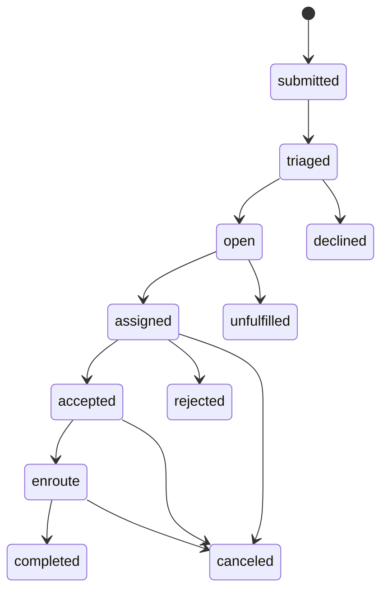
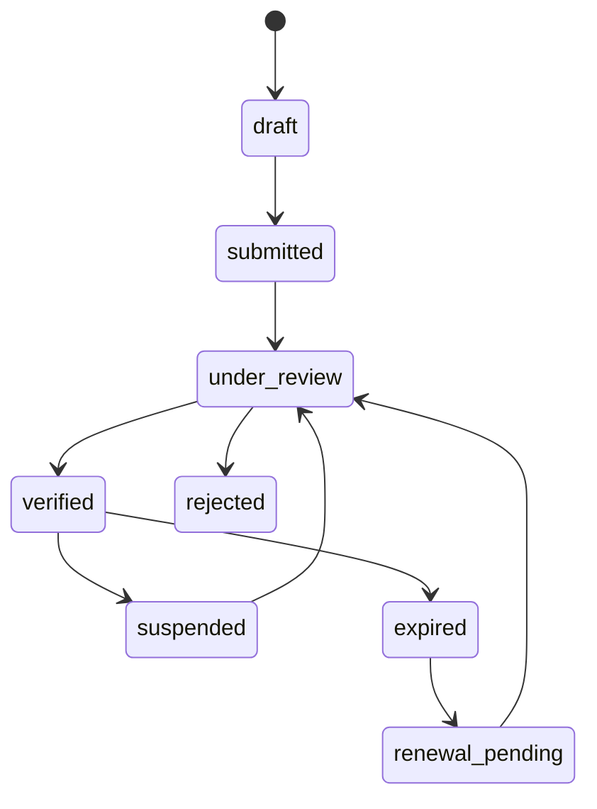
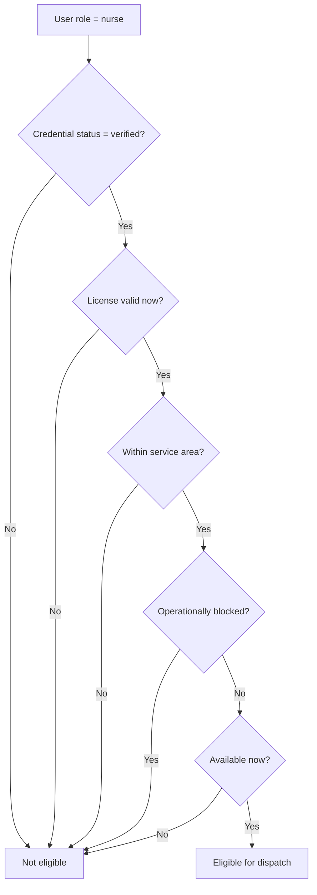

# NurseConnect Blueprint

**Date:** 2026-04-13

**Goal:** Define the business, operating, and product blueprint for NurseConnect so the repo can evolve toward a coherent company model instead of a loose dispatch MVP.

## Thesis

NurseConnect should be built as a managed care-dispatch marketplace for low-acuity home nursing.

It is not a generic "Uber for nurses." It is a regulated marketplace with a hard trust gate:

- NurseConnect owns the customer relationship and dispatches care.
- Demand is referral-led first, with direct consumer demand as a secondary lane.
- Supply is licensed, verified nurse capacity, not open self-serve onboarding.
- The launch wedge is scheduled-first home visits, with same-day simple visits as an opportunistic fast lane.
- Launch should be city by city, with density before coverage.

## Problem

The current repo has a dispatch core, but it does not yet have a canonical product blueprint.

That creates drift:

- business intent lives partly in README copy, partly in launch hardening docs, and partly in code behavior
- nurse self-serve flows still conflict with the intended licensed-and-verified supply model
- the product promise is broader than the current operational shape
- the repo lacks a single target model that can guide architecture, roadmap, and scope decisions

This blueprint defines that target model.

## Brownfield Reality

This blueprint governs a brownfield V3 codebase, not a greenfield build.

The current repo still contains contradictions that the blueprint is meant to eliminate:

- a legacy profile UI still exposes a role selector in `apps/web/src/app/profile/page.tsx:84`, even though the backing `PUT /api/profile` route is deprecated in `apps/web/src/app/api/profile/route.ts:24`
- active self-serve nurse conversion still exists in `apps/web/src/app/api/me/become-nurse/route.ts:16` and `apps/web/src/components/dashboard/become-nurse-card.tsx:24`
- nurse onboarding still collects license data and proceeds directly through profile completion in `apps/web/src/app/(auth)/onboarding/page.tsx:30` and `apps/web/src/app/api/me/nurse/route.ts:15`
- allocation currently matches on `is_available` only in `apps/web/src/server/requests/allocate-request.ts:64`
- admin tooling currently supports requests, reassignment, and user-role changes, but not credential review, in `apps/web/src/app/admin/page.tsx:63`
- the request contract only captures address and coordinates in `packages/contracts/src/requests.ts:3`
- legacy Firestore artifacts still exist, including permissive rules in `packages/database/firestore.rules:1`, but they are not the governing trust model for V3 and must not drive new design decisions

This means the blueprint is not implementation-ready by itself. It must also specify the transition mechanics that bring the current repo into alignment.

## Immediate Brownfield Corrections

Before new feature work expands the product surface, the repo should close the highest-risk contradictions:

1. Remove the legacy profile role-toggle UI or make it read-only.
2. Remove self-serve nurse activation from patient-facing flows.
3. Treat nurse dispatch eligibility as derived from credential state, not role alone.
4. Add a first-class credential contract and admin review workflow.
5. Extend the request contract to cover referral-led intake and scheduled versus same-day demand.

## Business Model

NurseConnect is a managed marketplace that connects households and referral partners to verified local nurses for in-home care visits.

### Demand

- **Primary channel:** referral-led demand from doctors, clinics, and discharge planners
- **Secondary channel:** direct consumer demand from patients and families
- **Primary payer at launch:** patient or family, private-pay per visit

Referral-led demand should be the main growth engine in the first year because it is denser, more trusted, and more predictable than pure consumer acquisition. Direct consumer demand still matters, but it should support utilization and brand pull rather than define the whole go-to-market motion.

### Supply

- **Launch supply model:** contractors first
- **Longer-term option:** mixed contractor and managed supply
- **Hard rule:** no nurse enters dispatchable supply without license verification

Supply is not created by role conversion. A nurse becomes eligible only after NurseConnect captures license information, records the validity period, and verifies the credential.

### Care Wedge

- **Primary wedge:** scheduled post-discharge and chronic-support home visits
- **Secondary fast lane:** same-day simple visits when a verified nurse is nearby and available
- **Launch scope:** non-emergency, low-acuity, repeatable visit types only

## Operating Model

NurseConnect should run one unified request system that supports both scheduled and same-day visits.

### Core Operating Loop

1. A referral partner or household submits a request.
2. NurseConnect triages the request for serviceability, acuity, and geography.
3. The system routes the request to verified, non-expired, available nurse supply.
4. The nurse accepts, travels, performs the visit, and updates status.
5. The visit closes with service confirmation, payment completion, and an auditable event trail.
6. Follow-up and repeat visits feed retention and referral trust.

### Supply Operations

Supply operations need a first-class compliance workflow:

- nurse application or onboarding record
- license number, jurisdiction, and validity period
- verification decision
- suspension and renewal handling
- automatic removal from dispatch eligibility when credentials expire or fail review

Nurses may manage operational data such as availability or location, but they do not control credential truth.

### Demand Operations

Demand operations should treat referral and consumer intake as two entry points into the same service system:

- one request model
- one triage model
- one dispatch model
- one visit lifecycle

Cases outside launch scope should be declined or redirected rather than forced through the network.

### Control Layer

NurseConnect needs an operations desk, not just automated matching.

Admins and ops staff must be able to:

- verify nurse credentials
- review and triage requests
- reassign visits
- observe lifecycle events end to end
- monitor supply reliability and exceptions

## Product Blueprint

The product should converge around four layers.

### 1. Demand Layer

This layer owns request intake and patient context:

- patient and household profiles
- referral source capture
- address and timing preferences
- care-request creation
- repeat-visit intent

### 2. Trust Layer

This layer owns nurse credentialing:

- license submission
- document handling
- expiry tracking
- verification
- suspension
- renewal
- supply activation and deactivation

### 3. Dispatch Layer

This layer owns service execution:

- scheduling
- same-day matching
- accept or reject
- enroute
- completion
- reassignment
- request and visit events

### 4. Control Layer

This layer owns operational visibility and quality:

- admin queue
- exception handling
- audit trail
- partner visibility
- nurse reliability signals
- service governance

### Launch User Surfaces

The launch product should support four user surfaces:

- **Patient / family:** request care, view status, confirm visits, manage repeat care
- **Referral partner:** submit requests, track progress, receive visibility into outcomes
- **Nurse:** manage profile, submit license documents, set availability and location, handle assigned visits
- **Admin / ops:** verify nurses, triage requests, reassign work, review audit and quality signals

### Product Rules

The product must preserve three rules:

1. No nurse enters supply without verification.
2. Scheduled and same-day visits share one request system.
3. Ops has full event visibility across the service lifecycle.

## Canonical Contracts

The blueprint needs explicit contracts so teams do not fill in the gaps differently.

### Glossary

- **Request:** the intake object representing a patient need for service
- **Assignment:** a dispatch attempt linking a request to a nurse
- **Visit:** the service-delivery record created from a fulfilled assignment
- **Dispatch:** the act of routing an eligible nurse to a request
- **Credential:** the nurse license and related compliance evidence
- **Verification:** the compliance decision that moves a credential into or out of approved status
- **Eligible supply:** nurse capacity that is verified, in-date, available, and allowed to accept work
- **Referral:** a demand source tied to a partner or professional referrer

### Core Entities

The target product model should treat these as separate concepts:

- **User:** identity and top-level platform role
- **Patient profile:** patient-contact and household context used for care requests
- **Nurse profile:** nurse-facing operational profile such as bio, phone, location preferences, and availability
- **Nurse credential:** license number, jurisdiction, validity dates, verification state, reviewer, review timestamps, and supporting evidence metadata
- **Referral source:** the origin of a request, whether consumer or partner-generated
- **Service request:** the intake and dispatch object that captures type, timing, scope, and current lifecycle state
- **Assignment:** the relationship between a request and one nurse candidate or accepted dispatch
- **Visit:** the record of delivered care, completion details, and post-visit summary
- **Service area:** the configured city or zone where demand and supply are considered in-bounds
- **Financial transaction:** payment authorization, capture, refund, payout, and reconciliation records

### Authorization Model

The target platform needs a richer authorization model than the current three-role enum:

- **Patient / family:** create and manage only their own requests and visit history
- **Nurse:** manage operational profile, availability, and assigned work; cannot alter credential truth
- **Referral partner:** create requests and see only the requests they originated or are explicitly shared with
- **Admin ops:** triage requests, reassign work, and monitor service execution
- **Admin compliance:** review credentials, verify, suspend, expire, and renew supply eligibility
- **Admin super:** manage privileged configuration such as roles, service areas, and policy overrides

The current repo does not yet model these scopes. Until it does, partner and admin capabilities should not be shipped in ways that imply broader authorization than the system can enforce.

### Geographic Model

City-by-city launch requires a first-class service-area concept:

- each launch city is a configured service area
- requests outside an active service area are declined, waitlisted, or redirected
- nurse eligibility is constrained by both service area and license jurisdiction
- distance-based matching should only run after service-area validation succeeds

Bare coordinates are not enough for the long-term model.

## Canonical State Machines

### Request Lifecycle

The current request lifecycle covers dispatch and completion, but the canonical lifecycle should include pre-dispatch intake decisions:

- `submitted` -> request has been created but not yet triaged
- `triaged` -> scope, geography, and urgency have been assessed
- `open` -> ready for assignment
- `assigned` -> routed to a nurse
- `accepted` -> nurse accepted the assignment
- `enroute` -> nurse is traveling to the patient
- `completed` -> service was delivered
- `canceled` -> canceled by patient, admin, or system policy
- `rejected` -> nurse rejected the assignment
- `declined` -> request is out of scope or unsupported before dispatch
- `unfulfilled` -> in scope, but no eligible supply was available in time

The existing `open -> assigned -> accepted -> enroute -> completed/canceled/rejected` flow remains a valid subset, but the blueprint target needs the intake-side states too.

### Credential Lifecycle

Credential state must be explicit and reviewable:

- `draft` -> nurse has not submitted enough information
- `submitted` -> credential package is ready for review
- `under_review` -> compliance is actively reviewing
- `verified` -> approved and in-date
- `rejected` -> denied and not eligible for supply
- `suspended` -> temporarily or permanently blocked
- `expired` -> valid-until date has passed
- `renewal_pending` -> renewal submitted but not yet re-approved

Phase 1 implementation may project this lifecycle through the existing `nurses.status` field for delivery speed, but the stored state model must match the canonical lifecycle rather than collapse into an underspecified free-text flag. If the team keeps credential truth on `nurses` temporarily, that column should become an enum aligned to the approved lifecycle. If the team introduces a dedicated `nurse_credentials` record, `nurses.status` should become a derived projection rather than a separate source of truth.

### Nurse Eligibility

Dispatch eligibility should be derived, not manually toggled:

`eligible = role == nurse AND credential_status == verified AND license_valid_now == true AND is_available == true AND within_service_area == true AND not_currently_blocked == true`

This is the core trust invariant. `isAvailable` matters only after the rest of the predicate is true.

## Repo Implications

The repo should evolve toward five product domains:

1. **Intake and patient context**
2. **Nurse credentialing**
3. **Dispatch and visits**
4. **Ops and quality**
5. **Revenue and settlement**

That means the repo should stop treating nurse activation as a simple role toggle and start modeling supply eligibility as a separate domain with its own workflows and controls.

## Request, Assignment, and Visit Decision

The repo already has separate `service_requests`, `assignments`, and `visits` tables, but the current dispatch flow does not fully use those boundaries.

The blueprint decision is:

- a **request** is the source-of-truth intake object
- an **assignment** is a dispatch attempt or accepted routing between a request and a nurse
- a **visit** is the service-delivery record created from a fulfilled assignment

That means:

- scheduled and same-day work should remain one request system
- reassignment should create or update assignment history without destroying request history
- clinical completion and ratings belong on visits, not on the request itself

## Revenue and Settlement

Even in the simplest private-pay launch, the product needs a minimal financial model.

### Phase 1 Revenue Model

- pricing is based on a launch-city rate card and request type
- scheduled visits may authorize payment at booking
- same-day visits may authorize payment before dispatch confirmation
- capture should occur on visit completion or according to explicit cancellation policy
- payout records for nurses should be created from completed visits, even if actual contractor settlement remains manual at first

### Required Financial Records

The product should be able to answer:

- what was the quoted price
- what payment was authorized
- what payment was captured or refunded
- what payout is owed to the nurse
- what operational event caused the financial action

Processor choice can wait. Transaction traceability cannot.

## Roadmap

### Phase 1: Launch Wedge

Launch in one city with:

- verified licensed nurse supply
- referral-led demand
- private-pay visits
- scheduled-first requests
- same-day simple visits only when nearby supply exists

### Phase 2: Density and Repeatability

Strengthen the local operating loop:

- repeat visits
- partner referral workflows
- nurse reliability scoring
- compliance renewal automation
- city-level service metrics

### Phase 3: Multi-City Expansion

Replicate the model city by city without weakening verification, reliability, or response-time standards.

### Phase 4: Broader Commercial Surface

Only after the core loop is stable should NurseConnect expand into:

- richer partner tooling
- broader care programs
- deeper settlement or reimbursement paths
- more advanced network operations

## What Must Exist Early

- credential verification and expiry enforcement
- unified scheduled and same-day request model
- admin ops desk with triage, reassignment, and audit visibility
- private-pay charging and payout traceability
- referral intake that is as real as consumer intake

## What Should Wait

- open-ended urgent-care positioning
- broad reimbursement complexity before private-pay works
- white-label or partner-branded modes
- broad care-management sprawl beyond the dispatch core
- geographic expansion before local density is proven

## Failure Modes

The architecture must define behavior for common failure paths:

- **No eligible nurse available:** keep the request in an unfulfilled or open-exception state, surface it to ops, and communicate clearly to the patient or partner.
- **Credential expires before assignment:** nurse becomes ineligible immediately and is excluded from future matching.
- **Credential expires during an active assignment or visit:** complete the current work only if policy allows; otherwise escalate to admin ops and block future assignments.
- **Out-of-scope request:** mark the request declined with a reason and record the referral source that generated it.
- **Suspected fraudulent credential:** suspend supply eligibility, preserve the audit trail, and route to compliance review.
- **Service-area mismatch:** reject automatic dispatch and surface the request to manual review or decline.

## Phase 1 Success Criteria

These are the initial measurable launch gates for the first city. They can be tightened per market, but they should not stay implicit.

- at least `10` verified nurses with active, in-date credentials in the launch city
- at least `80%` of in-scope same-day requests receive an assignment decision within `30` minutes
- credential review turnaround time is at most `2` business days for standard submissions
- at least `90%` of accepted assignments reach completed-visit status
- out-of-scope and unfulfilled requests are explicitly classified rather than left as ambiguous failures

## End-State

If executed well, NurseConnect becomes a dispatch-centric in-home nursing network with:

- trusted local verified supply in each market
- a referral plus consumer demand flywheel
- a consistent operating model for low-acuity home nursing access

The company should expand by deepening the trust-and-dispatch core, not by piling unrelated features on top of an unstable service model.
